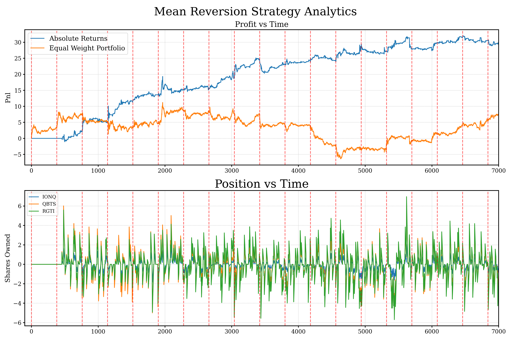

# Financial Anomaly Detection

This repository contains supplementary code and results for Section 4.2 of the dissertation **"Real-Time Anomaly Detection in Multidimensional Financial Time Series"** supervised by Idris Eckley and Florian Pein.  
The project investigates whether short lived anomalies (defined in this context as brief periods when residual returns across multiple assets move together in unexpected ways) can be detected in real time and traded profitably.

## Goal

To define a practical notion of “anomaly” in financial time series, detect such events as they occur, and evaluate whether they provide a tradable edge after accounting for latency and slippage.

## Approach

1. **Modelling:** Asset log prices are treated as having a latent mean and noise component. An anomaly is a transient, collective deviation in the noise terms. A mathematical formulation of this can be seen in `report_section_4.2`.
2. **Removing common structure:** A rolling PCA strips out dominant market factors, leaving residual returns.
3. **Smoothing:** Residuals are exponentially smoothed to reduce microstructure noise.
4. **Anomaly detection:** The CAPA algorithm flags segments where multiple smoothed residuals move together unexpectedly.
5. **Trading logic:**  
   - *Algorithm 1* bets on mean reversion when principal-component trends break out.
   - *Algorithm 2* seeks reconvergence after sudden negative correlations between correlated stocks.  
6. **Backtesting:** A simplified engine simulates latency and slippage to test strategies (bid–ask spread is not modelled). A plot of absolute returns vs time can be seen below. Total invested capital is always less than $400, on this particular run. 



## Repository Structure

- **alg_tools/**
  - `smoother.py` - exponential smoothing routine.
  - `capacc_wrapper.py` - Python wrapper for the R implementation of CAPA.
- **algorithms/**
  - `base.py` - base class from which subsequent algorithm will inherit.
  - `TradingStrategy.py` - mean-reversion on principal-component trends. 
- **backtesting/**
  - `backtester.py` - orchestrates simulations with latency and slippage.
  - `example_backtest.ipynb` - notebook demonstrating end-to-end usage.
  - `parameter_optimiser.py` - Bayesian optimization of strategy parameters.
  - `profiling.py` - usage of profiler to find bottlenecks.  

## Getting Started

1. Supply historical price data as a pandas DataFrame (datetime index, ticker columns).
2. Instantiate `TradingLogic` with the desired parameters and feed data incrementally.
3. Use `backtester.py` to run simulations; the notebook shows a typical workflow.

### R configuration

The CAPA wrapper relies on an R installation. Provide its location by
setting the ``R_HOME`` environment variable or by creating a
configuration file ``alg_tools/r_config.ini`` with the following
contents:

```
[R]
home=/path/to/R
```

The wrapper will add the appropriate ``bin`` (and ``x64`` on Windows)
subdirectory to ``PATH``.

## Caveats

- Results are illustrative; no bid-ask spread is modelled, and the value traded is usually very high relative to returns. Hence, the edge which is acquired from this strategy is inaccessible, due to being hidden by bid ask spreads. This is particularly true in the case of the Quantum Computing stocks, which are realtively illiquid when compared to other highly correlated stocks, such as US banking stocks.  

